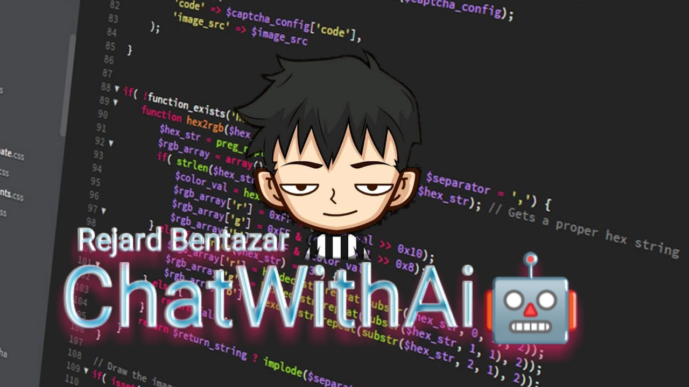

# ChatWithAiOfficial

An Educational Messenger Bot Made with love aims to Help ppl for studies

<a style="font-size:27px" href="https://m.me/j/Abbl63EsX-6_NN7W/">JOIN ChatWithAi🤖</a>

## Developer Social Info

- **Facebook**: [https://facebook.com/rejardbentazarofficial](https://facebook.com/rejardbentazarofficial)
- **GitHub**: [https://github.com/LeechShares](https://github.com/LeechShares)

## Table of Contents
- [Installation](#installation)
- [Usage](#usage)
- [Screenshots](#screenshots)
- [Credits](#credits)
- [Video](#video)
- [Contributing](#contributing)
- [License](#license)

## Installation
 FORK and Ilisan mo yung Appstate, fix mo ng kunte hshsh

## Usage
Go to config.json configure there , You can also add commands 

## Screenshots
SCREENSHOTS

##Credits
- LeechShares 
- Mirai

## Video
Installation guide para sa bobo

## Contributing
Yeh thats nice 

## License
License under the table